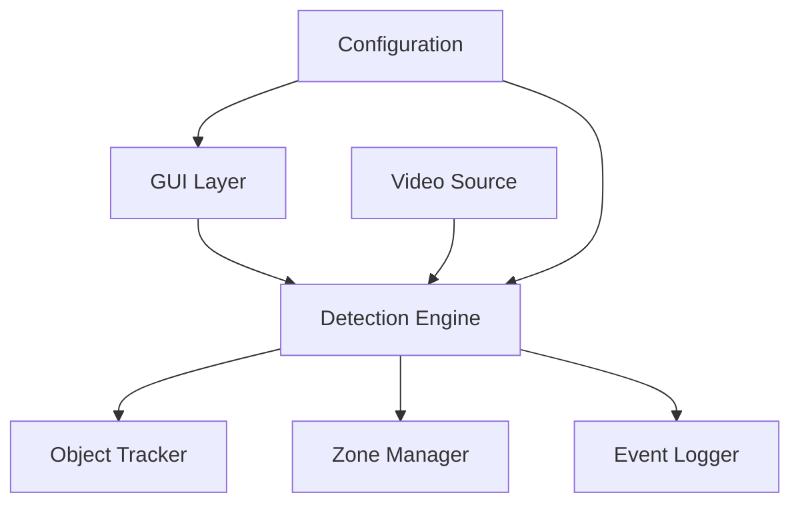
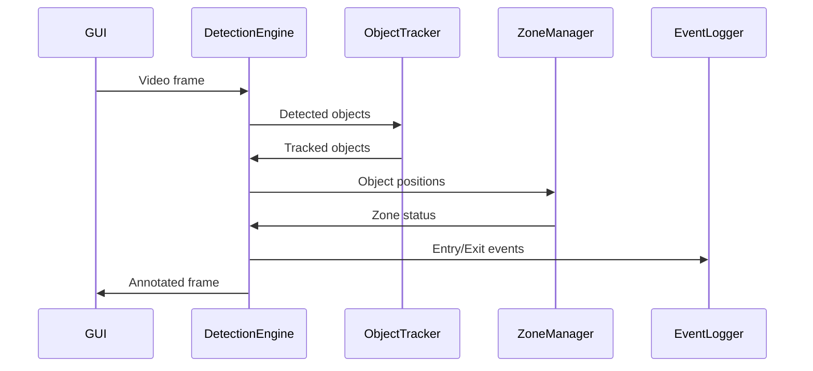

### Zone Intrusion Detection System - README

#### Overview
A video analytics application that detects and logs object movements in user-defined zones. Using YOLOv8 for object detection and centroid tracking, the system provides real-time monitoring of entry/exit events in restricted areas.

#### Key Features
- Interactive zone drawing on video frames
- Real-time object detection (people/vehicles)
- Centroid-based object tracking
- Zone entry/exit event logging
- Visual feedback of detected objects and zones
- Persistent zone storage (JSON format)

---

### Setup Instructions (Windows)

1. **Prerequisites**:
   - Python 3.8+
   - NVIDIA GPU recommended (for better performance)

2. **Installation**:
```cmd
# Create virtual environment
python -m venv venv
venv\Scripts\activate

# Install dependencies
pip install -r requirements.txt
```

3. **First Run Setup**:
```cmd
# The application will automatically:
# - Download YOLOv8 model (12.6MB)
# - Download test video (people-detection.mp4)
python src\main.py
```

---

### System Architecture



1. **GUI Layer** (PyQt5)
   - Video display with zoom/pan
   - Interactive zone drawing tools
   - Playback controls and event log display
   - Zone management (save/load/clear)

2. **Detection Engine** (YOLOv8)
   - Processes video frames at 15-30 FPS
   - Detects objects (people/vehicles)
   - Manages zone intrusion logic
   - Handles visualization overlay

3. **Object Tracker** (Centroid-based)
   - Maintains object identities across frames
   - Uses motion smoothing for stable tracking
   - Handles temporary occlusions

4. **Zone Manager** (Shapely)
   - Polygon-based zone definition
   - Efficient point-in-polygon checks
   - JSON serialization for persistence

5. **Event Logger**
   - Timestamped event storage
   - Separate log file for intrusion events
   - Real-time GUI event display

---

### Key Logic Flow



1. **Frame Processing**:
   - Video frame captured
   - YOLOv8 detects objects (people/vehicles)
   - Detections passed to tracker

2. **Object Tracking**:
   - Centroid positions calculated
   - Object IDs maintained across frames
   - Motion smoothing applied

3. **Zone Checking**:
   - Current position checked against all zones
   - State machine tracks entry/exit status
   - 100ms confirmation prevents false positives

4. **Event Handling**:
   - Entry/exit events logged to file
   - Events displayed in GUI in real-time
   - Visual markers updated on video frame

---

### Libraries & Tools Used

| Category          | Tools/Libraries              | Purpose                          |
|-------------------|------------------------------|----------------------------------|
| **AI/Computer Vision** | YOLOv8, OpenCV             | Object detection and processing  |
| **Tracking**      | CentroidTracker, SciPy      | Object tracking                  |
| **Geometry**      | Shapely                     | Zone/polygon operations          |
| **GUI**           | PyQt5                       | User interface                   |
| **Utilities**     | NumPy, Requests, TQDM       | Math operations and downloads    |
| **Configuration** | PyYAML                      | Settings management              |
| **Logging**       | Python logging              | Event recording                  |

---

### How to Use

1. **Launch Application**:
   ```cmd
   python src\main.py
   ```

2. **Load Video**:
   - Click "Open Video" (test video loads automatically)
   - Or select your own MP4/AVI file

3. **Define Zones**:
   - Pause video on reference frame
   - Click "Draw Zone"
   - Left-click to place polygon vertices
   - Right-click to complete polygon
   - Name your zone (e.g., "Restricted Area")

4. **Run Detection**:
   - Click "Start Detection"
   - Observe real-time:
     - Object bounding boxes
     - Moving centroids (green dots)
     - Current zones for each object
     - Entry/exit events in log panel

5. **Review Results**:
   - Events saved to `logs/intrusion_events.log`
   - Zones saved via "Save Zones" button
   - FPS counter shows performance metrics

---

### Troubleshooting

**Common Issues**:
1. *Model download fails*:
   - Check internet connection
   - Delete `models/yolov8n.pt` and rerun
   - Verify MD5: 0305608151dd1725c9d7da6882ae52d5

2. *Low FPS*:
   - Reduce video resolution
   - Use smaller YOLO model (yolov8s.pt)
   - Enable GPU acceleration

3. *No detection events*:
   - Ensure zones cover moving objects' paths
   - Check confidence threshold in `config/settings.yaml`
   - Verify object classes are enabled (default: person)

**Log Files**:
- Application logs: `app.log`
- Intrusion events: `logs/intrusion_events.log`

---

### Sample Test Video
  
*People walking through corridor - ideal for testing entry/exit events*

---

### License
MIT License - Free for academic and commercial use
